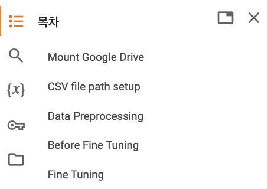
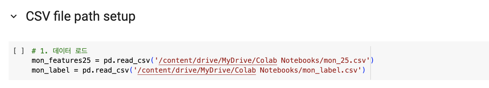

# ML Website Fingerprint Fine-Tuning

구글 코랩 환경에서 실행하는 것을 권장합니다.

#### 권장 구글 코랩 환경

- **RAM:** 12GB (훈련 중 최대 8GB 사용)
- **CPU:** Intel(R) Xeon(R) CPU @ 2.30GHz (Dual-Core)
- **DISK:** 107GB
<br><br><br><br>
## 실행 가이드

### 1. 구글 코랩 열기
- [https://colab.research.google.com/](https://colab.research.google.com/)으로 이동합니다.
- **파일** -> **노트 열기**를 클릭합니다. <br>
  

<br><br>
### 2. GitHub에서 노트북 불러오기
- **노트 열기** 에서 **GitHub** 탭을 클릭하고 아래 깃허브 주소를 입력합니다:
  ```plaintext
  https://github.com/Machineping/ML_website-fingerprint/tree/main

 

<br><br>
### 3. 필요한 노트북 파일 열기
실행할 노트북 파일을 선택하면 됩니다:

- **closed-world/Random Forest.ipynb**
- **open-world/binary/Random Forest.ipynb**
- **open-world/multiclass/Random Forest.ipynb**


 
<br><br>

### 4. 학습 데이터 준비

아래 링크를 통해 학습 데이터를 다운로드 혹은 MyDrive에 업로드 해주세요.
해당 CSV 파일이 MyDrive에 있어야 실행 가능합니다. 
[https://drive.google.com/drive/folders/1jgDdRLgU2XikmnQQt87z6tyUKF3U88TR?usp=drive_link](https://drive.google.com/drive/folders/1jgDdRLgU2XikmnQQt87z6tyUKF3U88TR?usp=drive_link)

<br><br>
### 5. Mount Google Drive
목차 중 먼저 **Mount Google Drive** 셀을 실행하여 csv 파일이 있는 구글 드라이브로 연결합니다. 

모든 노트북은 동일하게 총 5개 목차로 구성되어 있습니다:
1. **Mount Google Drive**
2. **CSV file path setu**
3. **Data preprocessing**
4. **1. Before Fine-Tuning**
5. **2. Fine-Tuning**

 

<br><br>
### 6. CSV 파일 경로 설정
**CSV file path setup** 셀을 실행하기 전에 꼭 **CSV 파일 경로**를 지정해주세요. 




<br><br><br><br>

# ML Website Fingerprint Fine-Tuning

It is recommended to run this in the Google Colab environment.

#### Recommended Google Colab Environment

- **RAM:** 12GB (up to 8GB used during training)
- **CPU:** Intel(R) Xeon(R) CPU @ 2.30GHz (Dual-Core)
- **DISK:** 107GB

<br><br><br><br>

## Execution Guide

### 1. Open Google Colab
- Go to [https://colab.research.google.com/](https://colab.research.google.com/).
- Click on **File** -> **Open Notebook**.
  <br>
  

<br><br>

### 2. Load Notebook from GitHub
- In **Open Notebook**, click the **GitHub** tab and enter the following GitHub URL:
  ```plaintext
  https://github.com/Machineping/ML_website-fingerprint/tree/main
  ```

  

<br><br>

### 3. Open the Required Notebook Files
Select the notebook file you want to run:

- **closed-world/Random Forest.ipynb**
- **open-world/binary/Random Forest.ipynb**
- **open-world/multiclass/Random Forest.ipynb**

  

<br><br>

### 4. Prepare the Training Data
Download or upload the training data to your **MyDrive** using the link below.  
Make sure the required CSV files are present in **MyDrive** before running the notebook.

[https://drive.google.com/drive/folders/1jgDdRLgU2XikmnQQt87z6tyUKF3U88TR?usp=drive_link](https://drive.google.com/drive/folders/1jgDdRLgU2XikmnQQt87z6tyUKF3U88TR?usp=drive_link)

<br><br>

### 5. Mount Google Drive
First, execute the **Mount Google Drive** cell from the table of contents to connect to the Google Drive containing the CSV file.

All notebooks are structured with the following five sections:
1. **Mount Google Drive**
2. **CSV file path setup**
3. **Data preprocessing**
4. **1. Before Fine-Tuning**
5. **2. Fine-Tuning**

  

<br><br>

### 6. Set the CSV File Path
Before running the **CSV file path setup** cell, ensure the **CSV file path** is specified correctly.

  
