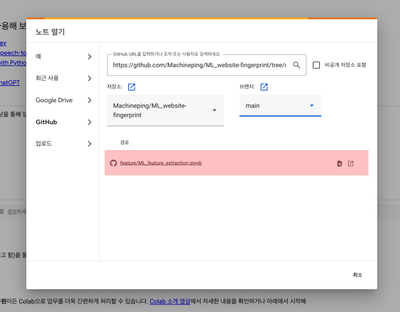

# ML Website Fingerprint Fine-Tuning

**구글 코랩 환경**에서 실행하는 것을 권장합니다.

#### 권장 구글 코랩 환경

- **RAM:** 12GB (훈련 중 최대 8GB 사용)
- **CPU:** Intel(R) Xeon(R) CPU @ 2.30GHz (Dual-Core)
- **DISK:** 107GB

## 노트북 실행 방법

#### 1. 구글 코랩 열기
- [https://colab.research.google.com/](https://colab.research.google.com/)으로 이동합니다.
- **파일** -> **노트 열기**를 클릭합니다.

   

#### 2. GitHub에서 노트북 불러오기
- **노트 열기** 에서 **GitHub** 탭을 클릭하고 아래 깃허브 주소를 입력합니다.:
'''https://github.com/Machineping/ML_website-fingerprint/tree/main'''
 
 

#### 3. 필요한 노트북 파일 열기
실행할 노트북 파일을 선택하면 됩니다:

- **closed-world/Random Forest.ipynb**
- **open-world/binary/Random Forest.ipynb**
- **open-world/multiclass/Random Forest.ipynb**

## 노트북 실행 전 준비 사항

#### 학습 데이터 준비

아래 링크를 통해 학습 데이터를 다운로드 혹은 MyDrive에 업로드 해주세요.
해당 CSV 파일이 MyDrive에 있어야 실행 가능합니다. 

[https://drive.google.com/drive/folders/1jgDdRLgU2XikmnQQt87z6tyUKF3U88TR?usp=drive_link](https://drive.google.com/drive/folders/1jgDdRLgU2XikmnQQt87z6tyUKF3U88TR?usp=drive_link)

모든 노트북은 동일하게 총 5개 목차로 구성되어 있습니다:
1. **Mount Google Drive**
2. **CSV 파일 경로 설정**
3. **데이터 전처리**
4. **1. Before Fine-Tuning**
5. **2. Fine-Tuning**

 *(목차 그림 이미지 삽입 예정)*

### 1. Mount Google Drive
**Mount Google Drive** 셀을 실행하여 csv 파일이 있는 구글 드라이브로 연결합니다. 

### 2. CSV 파일 경로 설정
**CSV file path setup** 셀을 실행하기 전에 **CSV 파일 경로**를 지정해주세요. 

 *(그림 삽입 예정)*
